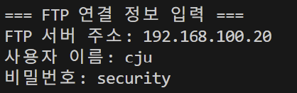

# 발표

# 1. 🔐 **보안 요구사항 정의**

1. 사용자 인증 정보는 암호화된 연결(SFTP)을 통해 전송 해야 한다.
2. 로그인 실패 횟수 제한을 두어 무차별 대입 공격을 방지해야 한다.
3. 비밀번호를 입력할 때, 화면과 시스템에 기록이 남지 않아야 한다.
4. 워드리스트 로그인 기능은 운영 환경에서 비활성화 되어야 한다.
” passwd.txt에 여러가지 경우의 비밀번호를 적어 놓고 무차별 대입 공격 방지”

---

# 2. 보안 설계

### ***개발 부분 설계***

**1. 암호화된 연결을 통한 사용자 인증 (FTP_TLS)**

`FTP_TLS`를 사용하여 **암호화된 연결**을 설정. 
 ㄴ  로그인 정보 및 데이터 암호화.  (`prot_p()` 메서드로 데이터 전송도 암호화.)

**2. 로그인 실패 횟수 제한 (무차별 대입 공격 방지)**

- 로그인 실패 횟수 제한: 실패 횟수가 일정 수 이상일 경우 계정을 잠그거나 **딜레이** 적용. 
   (`retry_count`와 `MAX_RETRIES`를 활용해 실패를 추적.)

**3. 비밀번호 입력 시 화면과 시스템 기록에서 숨기기**

- `getpass` 모듈을 사용하여 비밀번호 입력 시 화면에 표시되지 않도록 설정. 
- 시스템 로그에 비밀번호가 기록되지 않도록 보안 강화.

**4. 워드리스트 로그인 기능 비활성화**

- 개발/테스트 환경에서만 워드리스트 로그인 기능 사용. 
- 운영 환경에서는 환경 변수(`ENV=production`)를 통해 워드리스트 기능 비활성화. 
- `args.userlist`, `args.passlist`와 관련된 기능 비활성화.

**5. 사전 대입 공격 방지 (비밀번호 파일 사용 방지)**

- `passwd.txt`와 같은 비밀번호 파일 사용 금지. 
- **워드리스트 로그인 기능**을 비활성화하거나, 중요한 비밀번호 파일은 애플리케이션 외부에 보관.

---

### ***테스트 부분 설계***

**1. 암호화된 연결을 통한 사용자 인증 (FTP_TLS)**

-  Wireshark를 사용하여 데이터가 평문으로 전송되지 않는지 확인. 
- 로그인 시 사용자명과 비밀번호가 암호화된 상태로 전송되는지 점검.

**2. 워드리스트 로그인 기능 비활성화**

- 운영 환경에서 **워드리스트 로그인 기능**이 비활성화 되었는지 확인. 
- `ENV=production` 환경 변수 설정이 정상적으로 적용되어 기능이 차단되는지 검증.
 - 워드리스트 기능이 비활성화된 환경에서 로그인 시도.

**3. 로그인 실패 횟수 제한 (무차별 대입 공격 방지)**

- **로그인 실패 테스트**: 실패한 로그인 시도 후 계정 잠금이나 딜레이가 정상적으로 작동하는지 확인. 
- **다양한 공격 시나리오**에서 계정 잠금이나 딜레이 적용 여부 확인. 

**4. 비밀번호 입력 시 화면과 시스템 기록에서 숨기기**

- **입력 시 화면 검증**: 비밀번호가 화면에 표시되지 않는지 확인. 
- 비밀번호가 **시스템 로그**에 기록되지 않도록 점검. 

---

# 3. 코드 개발

Main.py

```python
import sys
import os
import argparse
import getpass
from typing import List
from ftplib import FTP_TLS, error_perm

# 프로젝트 루트 디렉토리를 Python 경로에 추가
project_root = os.path.dirname(os.path.dirname(os.path.dirname(os.path.abspath(__file__))))
sys.path.append(project_root)

from client.FTPClient import FTPClient

MAX_LOGIN_ATTEMPTS = 5

def print_menu():
    print("\n=== FTP 클라이언트 메뉴 ===")
    print("1. 파일 목록 보기")
    print("2. 파일 업로드")
    print("3. 파일 다운로드")
    print("4. 종료")
    print("========================")
    return input("메뉴를 선택하세요 (1-4): ")

def show_file_list_menu(files: List[str]) -> int:
    print("\n=== 다운로드할 파일을 선택하세요 ===")
    for i, file in enumerate(files, 1):
        print(f"{i}. {file}")
    print("0. 취소")

    while True:
        try:
            choice = int(input(f"\n파일 번호를 선택하세요 (0-{len(files)}): "))
            if 0 <= choice <= len(files):
                return choice
            print("잘못된 선택입니다.")
        except ValueError:
            print("숫자를 입력해주세요.")

def get_credentials_with_retries(host: str) -> FTPClient | None:
    for attempt in range(1, MAX_LOGIN_ATTEMPTS + 1):
        user = input("사용자 이름: ").strip()
        password = getpass.getpass("비밀번호: ")
        client = FTPClient(host, user, password)
        if client.connect():
            print(" 로그인 성공")
            return client
        else:
            print(f"로그인 실패 {attempt}/{MAX_LOGIN_ATTEMPTS}")
            if attempt < MAX_LOGIN_ATTEMPTS:
                print("서버 주소를 다시 입력해주세요.")
                host = input("접속할 FTP 서버 주소를 입력하세요: ").strip()
    print(" 로그인 실패 횟수 초과. 종료합니다.")
    return None

def main():
    host = input("접속할 FTP 서버 주소를 입력하세요: ").strip()
    client = get_credentials_with_retries(host)
    if not client:
        return

    try:
        while True:
            choice = print_menu()

            if choice == "1":
                print("\n=== 파일 목록 ===")
                files = client.list_files()
                if files:
                    for f in files:
                        print(f)
                else:
                    print(" 파일이 없거나 목록을 가져올 수 없습니다.")

            elif choice == "2":
                local_path = input("업로드할 파일 경로를 입력하세요: ").strip()
                if not os.path.exists(local_path):
                    print("해당 경로에 파일이 존재하지 않습니다.")
                    continue
                print(f"{local_path} 업로드 중...")
                client.upload_file(local_path)

            elif choice == "3":
                files = client.get_simple_file_list()
                if not files:
                    print("다운로드 가능한 파일이 없습니다.")
                    continue
                file_choice = show_file_list_menu(files)
                if file_choice == 0:
                    continue
                remote_file = files[file_choice - 1]
                local_path = os.path.join("C:\\Users\\artbi\\Desktop", remote_file)
                print(f"{remote_file} → {local_path} 다운로드 중...")
                client.download_file(remote_file, local_path)

            elif choice == "4":
                print("프로그램을 종료합니다.")
                break
            else:
                print("잘못된 선택입니다.")
    finally:
        client.disconnect()

if __name__ == "__main__":
    main()

```

FTPClitent.py

```python
# FTPClient.py

from ftplib import FTP_TLS, error_perm
import os
from typing import List

class FTPClient:
    def __init__(self, host: str, user: str, passwd: str):
        self.host = host
        self.user = user
        self.passwd = passwd
        self.ftp = None

    def connect(self) -> bool:
        """FTPS 서버에 연결"""
        try:
            self.ftp = FTP_TLS(self.host)
            self.ftp.login(user=self.user, passwd=self.passwd)
            self.ftp.prot_p()  # 데이터 채널 보호 모드 설정
            
            # SSL 세션 재사용 문제 해결
            self.ftp.set_pasv(False)  # PASV 모드 비활성화
            self.ftp.set_pasv(True)   # 다시 활성화
            
            print(f"Connected securely to {self.host}")
            print(f"Welcome message: {self.ftp.getwelcome()}")
            return True
        except error_perm as e:
            if "530 Login incorrect" in str(e):
                print(f"Connection failed: 530 Login incorrect")
            elif "530 User not found" in str(e):
                print(f"Connection failed: 530 User not found")
            else:
                print(f"Connection failed: {str(e)}")
            return False
        except Exception as e:
            print(f"Connection failed: {str(e)}")
            return False
        
    def list_files(self, path: str = ".") -> List[str]:
        """현재 디렉토리의 파일 목록 조회"""
        try:
            files = []
            self.ftp.dir(path, files.append)
            return files
        except Exception as e:
            print(f"Error listing files: {str(e)}")
            return []
        
    def get_simple_file_list(self) -> List[str]:
        """파일 이름만 리스트로 반환 (폴더 제외)"""
        try:
            all_items = []
            self.ftp.dir(all_items.append)
            
            files = []
            for item in all_items:
                if not item.startswith('d'):
                    filename = item.split()[-1]
                    files.append(filename)
            
            return files
        except Exception as e:
            print(f"Error getting file list: {str(e)}")
            return []

    def upload_file(self, local_path: str, remote_path: str = None) -> bool:
        """파일 업로드"""
        try:
            if not os.path.exists(local_path):
                print(f"Local file {local_path} does not exist.")
                return False
                
            if remote_path is None:
                remote_path = os.path.basename(local_path)
                
            with open(local_path, 'rb') as file:
                self.ftp.storbinary(f'STOR {remote_path}', file)
            print(f"Successfully uploaded {local_path} to {remote_path}")
            return True
        except Exception as e:
            print(f"Upload failed: {str(e)}")
            return False
        
    def download_file(self, remote_path: str, local_path: str = None) -> bool:
        """파일 다운로드"""
        try:
            if local_path is None:
                local_path = os.path.basename(remote_path)
                
            with open(local_path, 'wb') as file:
                self.ftp.retrbinary(f'RETR {remote_path}', file.write)
            print(f"Successfully downloaded {remote_path} to {local_path}")
            return True
        except Exception as e:
            print(f"Download failed: {str(e)}")
            return False

    def disconnect(self):
        """FTPS 연결 종료"""
        if self.ftp:
            self.ftp.quit()
            print("Disconnected from FTPS server")

```

# 4. 테스트

1. **비밀번호 입력 시 화면과 시스템 기록에서 숨기기**




1. **암호화된 연결을 통한 사용자 인증 (FTP_TLS)** 
- wireshark로 캡쳐

변경 전 코드


변경 후 코드


1. **워드리스트 로그인 기능 비활성화**

```python
# 수정한 코드에서 삭제
|
|
v
if has_args:
        # 인자가 있는 경우 해당 값 사용
        host = args.host if args.host else "192.168.100.20"
        if args.userlist or args.passlist:  # 워드리스트 모드
            base_path = os.path.dirname(os.path.abspath(__file__))
            userlist_file = os.path.join(base_path, args.userlist) if args.userlist else None
            passlist_file = os.path.join(base_path, args.passlist) if args.passlist else None
            user = userlist_file if args.userlist else (args.user if args.user else "cju")
            password = passlist_file if args.passlist else (args.password if args.password else "security")
        else:  # 일반 모드
            user = args.user if args.user else "cju"
            password = args.password if args.password else "security"
    else:
        # 인자가 없는 경우 사용자 입력 받기
        print("\n=== FTP 연결 정보 입력 ===")
        host = input("FTP 서버 주소: ").strip() or "192.168.100.20"
        user = input("사용자 이름: ").strip() or "cju"
        password = input("비밀번호: ").strip() or "security"
```

1. **로그인 실패 횟수 제한 (무차별 대입 공격 방지)**


# (유니테스트)

test_main.py

```python
import unittest
from unittest.mock import patch, MagicMock
from client.FTPClient import FTPClient
from main import get_credentials_with_retries
import sys
import os
sys.path.append(os.path.abspath(os.path.join(os.path.dirname(__file__), '..')))

class TestFTPClient(unittest.TestCase):

    def setUp(self):
        """테스트 환경 설정"""
        self.ftp_client = FTPClient("test_host", "test_user", "test_password")

    @patch("client.FTPClient.FTP_TLS")
    def test_connect_success(self, mock_ftp_tls):
        print("=======성공적으로 FTP 서버에 연결하는지 확인=======")
        mock_instance = mock_ftp_tls.return_value
        mock_instance.login.return_value = None
        mock_instance.getwelcome.return_value = "Welcome"

        result = self.ftp_client.connect()
        self.assertTrue(result)
        print("Ok")
        print("")
        print("")

    @patch("client.FTPClient.FTP_TLS")
    @patch("builtins.input", side_effect=["user"] * 5 + ["test_host"] * 5)  # 로그인 5회 + 서버 주소 5회
    @patch("getpass.getpass", return_value="wrong_password")
    def test_login_attempts_exceeded(self, mock_getpass, mock_input, mock_ftp_tls):
        print("=======로그인 5회 실패 후 None 반환 테스트=======")
        mock_instance = mock_ftp_tls.return_value
        mock_instance.login.side_effect = Exception("530 Login incorrect")  # 로그인 실패 처리

        result = get_credentials_with_retries("test_host")  # 로그인 시도

        self.assertIsNone(result)  # 로그인 실패 후 None 반환해야 함
        print("Ok")
        print("")
        print("")

    @patch("client.FTPClient.FTP_TLS")
    def test_connect_fail(self, mock_ftp_tls):
        print("=======로그인 실패 시 False 반환하는지 확인=======")
        mock_instance = mock_ftp_tls.return_value
        mock_instance.login.side_effect = Exception("Connection failed")

        result = self.ftp_client.connect()
        self.assertFalse(result)
        print("Ok")
        print("")
        print("")

    @patch("client.FTPClient.FTP_TLS")
    def test_list_files(self, mock_ftp_tls):
        print("=======파일 목록을 정상적으로 가져오는지 확인=======")
        mock_instance = mock_ftp_tls.return_value
        self.ftp_client.ftp = mock_instance  # 명시적으로 설정

        mock_instance.dir.side_effect = lambda path, callback: [callback("file1.txt"), callback("file2.txt")]

        result = self.ftp_client.list_files()
        self.assertIn("file1.txt", result)
        self.assertIn("file2.txt", result)
        print("Ok")
        print("")
        print("")

    @patch("client.FTPClient.FTP_TLS")
    @patch("os.path.exists", return_value=True)  # 파일이 존재하는 것으로 설정
    def test_upload_file(self, mock_exists, mock_ftp_tls):
        print("=======파일 업로드 기능 테스트=======")
        mock_instance = mock_ftp_tls.return_value
        self.ftp_client.ftp = mock_instance  # 명시적으로 설정

        mock_instance.storbinary.return_value = None  # 업로드가 성공적으로 완료됨

        with patch("builtins.open", MagicMock(return_value=MagicMock())):
            result = self.ftp_client.upload_file("dummy.txt")

        self.assertTrue(result)
        print("Ok")
        print("")
        print("")

    @patch("client.FTPClient.FTP_TLS")
    def test_download_file(self, mock_ftp_tls):
        print("=======파일 다운로드 기능 테스트=======")
        mock_instance = mock_ftp_tls.return_value
        self.ftp_client.ftp = mock_instance  # 명시적으로 설정

        mock_instance.retrbinary.return_value = None  # 가짜 다운로드 실행

        with patch("builtins.open", MagicMock(return_value=MagicMock())):
            result = self.ftp_client.download_file("server_file.txt", "local_file.txt")

        self.assertTrue(result)
        print("Ok")
        print("")
        print("")

    @patch("client.FTPClient.FTP_TLS")
    def test_disconnect(self, mock_ftp_tls):
        print("=======서버 연결 종료 기능 테스트=======")
        mock_instance = mock_ftp_tls.return_value
        self.ftp_client.ftp = mock_instance
        self.ftp_client.disconnect()

        mock_instance.quit.assert_called_once()
        print("Ok")
        print("")
        print("")

if __name__ == "__main__":
    unittest.main()
```


```
=======로그인 실패 시 False 반환하는지 확인=======
Connection failed: Connection failed
Ok

.=======성공적으로 FTP 서버에 연결하는지 확인=======
Connected securely to test_host
Welcome message: Welcome
Ok

.=======서버 연결 종료 기능 테스트=======
Disconnected from FTPS server
Ok

.=======파일 다운로드 기능 테스트=======
Successfully downloaded server_file.txt to local_file.txt
Ok

.=======파일 목록을 정상적으로 가져오는지 확인=======
Ok

.=======로그인 5회 실패 후 None 반환 테스트=======
Connection failed: 530 Login incorrect
로그인 실패 1/5
서버 주소를 다시 입력해주세요.
Connection failed: 530 Login incorrect
로그인 실패 2/5
서버 주소를 다시 입력해주세요.
Connection failed: 530 Login incorrect
로그인 실패 3/5
서버 주소를 다시 입력해주세요.
Connection failed: 530 Login incorrect
로그인 실패 4/5
서버 주소를 다시 입력해주세요.
Connection failed: 530 Login incorrect
로그인 실패 5/5
 로그인 실패 횟수 초과. 종료합니다.
Ok

.=======파일 업로드 기능 테스트=======
Successfully uploaded dummy.txt to dummy.txt
Ok

.
----------------------------------------------------------------------
Ran 7 tests in 0.026s

OK
```